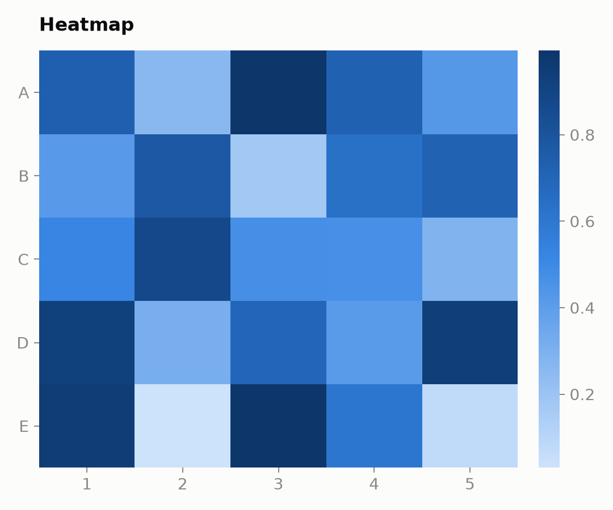

# jrviz

A tiny, modern-looking charting layer over matplotlib. Sensible defaults, a
validated colorblind-safe palette, and light/dark themes — in under 150 lines.

## Install

```bash
pip install -e .
```

Requires Python ≥ 3.9, `matplotlib` ≥ 3.6, and `numpy` ≥ 1.20 (both installed
automatically).

## Quickstart

```python
import jrviz as vz

vz.bar(["A", "B", "C"], [3, 7, 5], title="Widgets sold")
vz.show()          # display, or vz.save("chart.png") to write a PNG
```

## Gallery

Every image below is produced by [`examples/gallery.py`](examples/gallery.py) —
run `python examples/gallery.py` to regenerate them.

| | |
|---|---|
|  |  |
|  |  |



```python
import numpy as np
import jrviz as vz

# Bar with value labels
vz.bar(["Q1", "Q2", "Q3", "Q4"], [12, 19, 14, 22], title="Quarterly revenue", ylabel="$M")

# Multi-series line
x = np.arange(8)
vz.line(x, [[3, 4, 6, 5, 7, 8, 7, 9], [2, 3, 3, 4, 5, 5, 6, 7]],
        labels=["North", "South"], title="Weekly signups")

# Scatter in dark mode
vz.scatter(np.random.randn(120), np.random.randn(120), title="Scatter", dark=True)

# Histogram
vz.hist(np.random.randn(800), bins=30, title="Distribution", xlabel="value")

# Heatmap on the sequential ramp
vz.heatmap(np.random.rand(5, 5), row_labels=list("ABCDE"), col_labels=list("12345"),
           title="Heatmap")

vz.show()
```

### Composing into subplots

Every chart accepts an existing matplotlib `ax`, so you can build multi-panel
figures:

```python
import matplotlib.pyplot as plt
import jrviz as vz

fig, (left, right) = plt.subplots(1, 2, figsize=(12, 4))
vz.bar(["A", "B", "C"], [3, 7, 5], ax=left, title="Left")
vz.line(range(5), [0, 2, 1, 3, 2], ax=right, title="Right")
plt.show()
```

## API reference

### Common parameters

Every plotting function (`bar`, `line`, `scatter`, `hist`, `heatmap`) accepts
these keyword-only arguments:

| Parameter | Type | Default | Description |
|-----------|------|---------|-------------|
| `ax` | `matplotlib.axes.Axes` | `None` | Draw onto an existing axes instead of creating a new figure. |
| `dark` | `bool` | `False` | Use the dark theme (light surface/ink otherwise). |
| `title` | `str` | `None` | Left-aligned bold chart title. |
| `figsize` | `(float, float)` | `(7, 4.2)` | Figure size in inches (ignored when `ax` is given). |

`bar`, `line`, `scatter`, and `hist` additionally accept `xlabel` and `ylabel`
(`str`, default `None`) for axis labels. All plotting functions **return the
`Axes`** they drew on.

### `bar(categories, values, *, color=None, **common)`

Vertical bar chart with a value label above each bar.

| Parameter | Type | Default | Description |
|-----------|------|---------|-------------|
| `categories` | sequence of `str` | — | X-axis category labels. |
| `values` | sequence of `float` | — | Bar heights, one per category. |
| `color` | color | first palette hue | Fill color for all bars. |

### `line(x, series, *, labels=None, **common)`

One or more line series sharing an x-axis. Each series gets the next palette
hue and a marker at every point.

| Parameter | Type | Default | Description |
|-----------|------|---------|-------------|
| `x` | sequence | — | Shared x values. |
| `series` | 1-D or 2-D sequence | — | A single series (`[y0, y1, …]`) or a list of series (`[[…], [… ]]`). |
| `labels` | list of `str` | `None` | Legend label per series; a legend is drawn only when given. |

### `scatter(x, y, *, color=None, size=45, **common)`

Scatter plot of paired `x`/`y` points.

| Parameter | Type | Default | Description |
|-----------|------|---------|-------------|
| `x`, `y` | sequences | — | Point coordinates (equal length). |
| `color` | color | first palette hue | Marker color. |
| `size` | `float` | `45` | Marker area in points². |

### `hist(values, *, bins=20, color=None, **common)`

Histogram of a single distribution.

| Parameter | Type | Default | Description |
|-----------|------|---------|-------------|
| `values` | sequence of `float` | — | Values to bin. |
| `bins` | `int` or sequence | `20` | Bin count, or explicit bin edges. |
| `color` | color | first palette hue | Bar fill color. |

### `heatmap(matrix, *, row_labels=None, col_labels=None, **common)`

Magnitude grid colored with the sequential (light→dark blue) ramp, plus a
colorbar. Accepts the common parameters except `xlabel`/`ylabel`.

| Parameter | Type | Default | Description |
|-----------|------|---------|-------------|
| `matrix` | 2-D array | — | Values to color, shape `(rows, cols)`. |
| `row_labels` | list of `str` | `None` | Y-axis tick labels. |
| `col_labels` | list of `str` | `None` | X-axis tick labels. |

### Helpers

| Function | Description |
|----------|-------------|
| `style(dark=False)` | Apply the jrviz theme to matplotlib's global rcParams and return the color-role dict. Called automatically by every chart; use directly if you want the theme applied to your own matplotlib code. |
| `show(*args, **kwargs)` | `tight_layout()` then `plt.show()`. |
| `save(path, *args, **kwargs)` | `tight_layout()` then `plt.savefig(path, dpi=180, …)`. |

### Palettes

Three color sequences are exported for building your own marks:

| Name | Purpose |
|------|---------|
| `CATEGORICAL` | 8 distinct, colorblind-safe hues for categories/series. |
| `SEQUENTIAL` | Single-hue blue ramp (light→dark) for magnitude. |
| `DIVERGING` | Cool ↔ neutral ↔ warm triple for signed data. |
